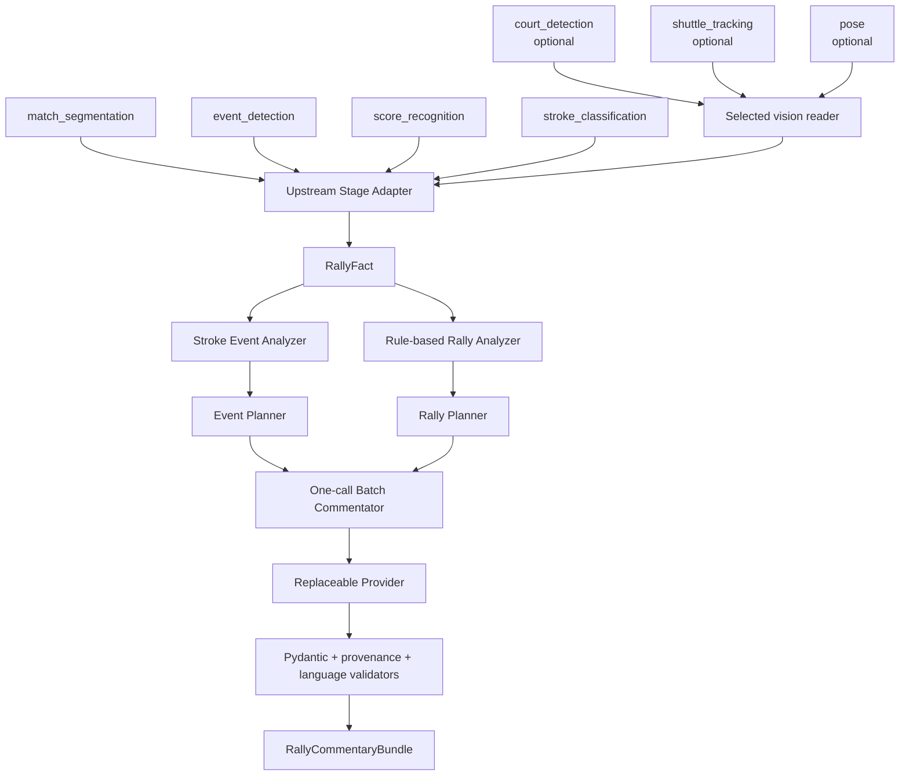
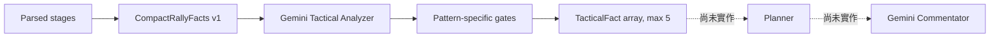
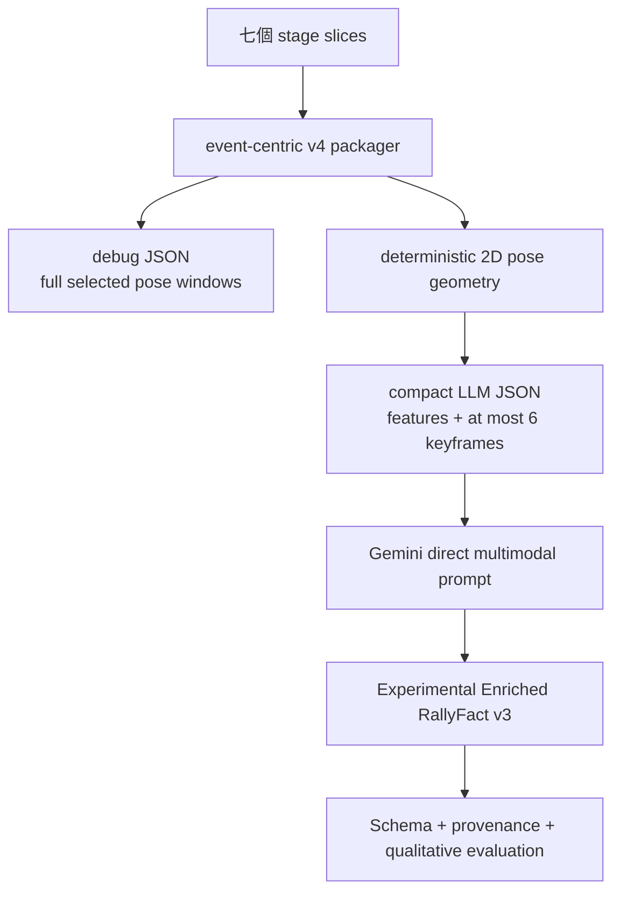

# Badminton Commentary 演算法與開發歷程報告

報告基準日：2026-08-13  
驗證基準：目前 working tree（包含尚未提交的 Tactical Analyzer 與 direct v4 實驗）

## 1. 報告範圍與狀態標記

本 repository 的目標是把 Badminton Analysis System 產生的結構化 stage artifacts，轉成可追溯、可驗證的單一 rally 文字賽評。核心原則是：電腦視覺模型在上游執行；commentary repository 只讀取輸出、建立 facts、規劃內容、呼叫可替換的 LLM provider，並驗證所有輸出 claim 的 provenance。

本文使用三種狀態，避免把研究中程式誤認為 production contract：

| 標記 | 意義 |
| --- | --- |
| **CURRENT** | 目前正式 service 或其直接依賴的可執行路徑 |
| **HISTORICAL** | 曾使用、仍可能為相容性保留，但不是目前推薦入口 |
| **PROPOSED / EXPERIMENTAL** | 已有實驗程式或設計，但尚未接入 production commentary |

來源清單見 [report_sources_inventory.md](report_sources_inventory.md)，逐項查核結果見 [implementation_verification_report.md](implementation_verification_report.md)。可存取 workspace 中沒有找到對話紀錄；因此本文的歷程只能以 Git、文件、程式碼、測試及現有實驗 artifacts 為證據，不把本次聊天內容當成 repository 史料。

> Conversation records were not found in the accessible workspace.

## 2. 目前整體架構

### 2.1 Production service（CURRENT）



正式 API 的單位是使用者選定的一個 `RallyFact`。`generate_from_stages()` 只是外層便利入口：先用 adapter 建立該 rally 的 `RallyFact`，再進入與 `generate(rally_fact=...)` 相同的生成流程。Production 不要求上游先自行製作 `commentary_input/*.json`。

主要來源：`src/badminton_commentary/services/rally_commentary.py`、`adapters/upstream.py`、`generation/rally_batch_commentator.py`、`schemas.py`。

### 2.2 Tactical branch（CURRENT，但尚未接入 Commentator）



`RallyCommentaryService.analyze_tactics()` 已能把 `CompactRallyFacts` 送到專用 provider 並取得已驗證的 `TacticalFact[]`。不過 `generate()` 與 `generate_from_stages()` 尚未讀取 Tactical Analyzer 結果，所以「TacticalFact → Planner → Commentator」是明確的下一個里程碑，不是目前 production 行為。

主要來源：`facts/builder.py`、`facts/tactical.py`、`analysis/tactical_analyzer.py`、`services/rally_commentary.py`。

### 2.3 Direct RallyFact v4（PROPOSED / EXPERIMENTAL）



這條路徑用於研究「把七個 stage 的單 rally slice 直接交給 Gemini 建立 enriched RallyFact」的可行性。Transport package 已是 v4，但模型輸出 contract 仍命名為 `experimental-enriched-rally-fact-v3`。它不在 `RallyCommentaryService.generate()` 的 execution path 中。

主要來源：`experiments/ttyvsasy/scripts/package_direct_rallyfact.py`、`analysis/pose_geometry.py`、`run_direct_rallyfact_v3.py` 及 direct experiment prompt。

## 3. Production 資料契約與演算法

### 3.1 Stage Adapter

| Stage | 讀取欄位與用途 | 目前處理 | 降級／限制 |
| --- | --- | --- | --- |
| `match_segmentation` | `fps`、`segments[]`；決定 rally frame/time boundary | 以 `segment_index` 取得單一 segment | 必要；index 越界直接拒絕 |
| `event_detection` | 全場 `events[].frame` | 只選 `start_frame <= frame <= end_frame` | 必要；事件本身沒有 player 語義 |
| `score_recognition` | `rallies[]` 的 score、server、game | 依 `segment_index` 對應 | 找不到可保留未知 score |
| `stroke_classification` | `event_index`、frame、segment、top/bottom、stroke、confidence | 用全場 event index join，再轉成 rally-local input | 重複／越界／frame 或 segment 不一致直接拒絕 |
| `highlights` | 可選 highlight score | 若存在才讀取 | 主 stage tree 不需要提供；缺少時為 `None` |
| `pose`、`court_detection`、`shuttle_tracking` | 選定 rally 的 compact multimodal facts | 只在 reader 收到 `segment_index` 時選段讀取 | 不會自動塞進 canonical `RallyFact` 或目前 Commentator prompt |

核心選段與 join 可表示為：

```text
selected_events = {
  (global_index, event)
  | segment.start_frame <= event.frame <= segment.end_frame
}

stroke_for_event = strokes_by_global_event_index[global_index]
```

Adapter 先驗證 stroke 宣告的 `segment_index` 與 frame boundary，再建立 local normalized events/strokes；`HitEvent.source_event_index` 保存原始全場 index。最後委派純 Python Fact Builder 排序與組裝，避免 Rally 144 混入 143 或 145。

Player identity 不由畫面位置猜測。上游的 `top` / `bottom` 必須經 caller 提供的 `CourtPositionToPlayer(top="a|b", bottom="a|b")` 顯式轉換，而且兩者不得相同。這是因為換場後 top/bottom 可能改變，不能在 adapter 內永久綁死。

### 3.2 Canonical RallyFact 與 Fact Builder

`RallyFact` 是 production 單 rally domain contract，主要欄位為 segment/time、score、server、事件序列、rally length 與 optional highlight。每個事件保存原始 `event_index`、frame/time、player、stroke type 與 confidence。

Fact Builder 的工作是 deterministic join，不呼叫 LLM、不修改輸入：

1. 建立 segment、score、highlight 的 `segment_index` 索引並拒絕重複。
2. 驗證 `Stroke.event_index` 在 events 範圍內且不重複。
3. 驗證 event 所屬 segment 存在且 frame 位於 boundary。
4. 以 `event_index` 將 stroke 接到 event。
5. 以 `(frame, event_index)` 排序，建立每個 segment 的 `RallyFact`。
6. 資料不完整時保留 `None`，而不是捏造 player、stroke 或 score。

主要來源：`analysis/fact_builder.py` 與 `tests/unit/test_fact_builder.py`。

### 3.3 Rule-based stroke/rally analysis

`rally_analyzer.py` 只從 stroke sequence 推導 pattern，不包含 player movement：

| Pattern | 規則摘要 | 語義邊界 |
| --- | --- | --- |
| serve-return | 前三拍為連續 event 且符合發球／回擊結構 | 只描述 stroke sequence |
| lift-to-attack | 挑球／高遠球之後接攻擊球 | 不等同該拍致勝或具特定意圖 |
| sustained attack | 同一 player 的攻擊球在限定 event 間距內重複出現 | 是候選攻勢，不證明最後得分原因 |
| rear-to-front stroke transition | 後場類 stroke 後出現網前類 stroke，間距不超過 6 event indexes | 只能說球路從後場球轉入網前處理，不能說球員跑到網前 |
| stroke diversity | 八個 event-index 範圍內至少三種 stroke category | 是球種多樣性，不是速度或節奏變化 |

Confidence band 的 production 門檻為 reliable `>= 0.70`、cautious `>= 0.50`；普通發球 salience 低於殺球、網前球、平快球等資訊量較高的球種。這套 salience 仍用於 summary planning；使用者已經選定 rally 時，事件生成不以 importance 或 speaking score 刪除 stroke。

主要來源：`analysis/rally_analyzer.py`、`analysis/stroke_event_analyzer.py`、`generation/planner.py`。

### 3.4 Planner 與單次 batch 生成

使用者選定 rally 後，production batch 流程會：

1. 以 `include_all_strokes=True` 分析所有有 stroke type/confidence 的事件。
2. 每拍以 `force_commentary=True` 建立 event plan，因此低 confidence stroke 也被送入 ordered context。
3. 由 selected-rally summary planner 優先安排 score/rally context、meaningful pattern，再選代表性 stroke。
4. 建立 `fact_catalog`、每拍 allowed facts 與 summary plan。
5. 把整個 rally 在一次 `provider.generate()` 呼叫送出，要求結構化 JSON。
6. 用 Pydantic 驗證 schema、segment 與逐拍 index/order，再驗證每句的 `source_fact_ids`。

因此一個 rally 的 production Commentator 是一次 Gemini request，不是每拍一次。若另外執行 Tactical Analyzer，則那是獨立的一次 provider request；目前兩次結果還未串成同一條生成鏈。

安全驗證分兩層：

- 語言安全問題（例如不支援的移動、因果、驚嘆號或低 confidence 缺少不確定措辭）可改用 deterministic fallback。
- Provenance、event order、segment mismatch 等結構性錯誤仍直接拒絕，不能用 fallback 掩蓋。

輸出 `RallyCommentaryBundle` 固定包含 `segment_index`、按原計畫順序的 event commentary，以及 optional summary。每個輸出單位均保存 `source_fact_ids`。

### 3.5 Gemini Provider 與設定

`GeminiProvider` 實作可替換的 `LLMProvider` protocol。API key 僅由設定指定的環境變數讀取，預設為 `GEMINI_API_KEY`；不應寫入 repository。Commentator 預設模型為 `gemini-flash-latest`，timeout 30 秒、最多 3 attempts。Retry status 包含 408、429、500、502、503、504；model fallback status 包含 404、500、502、503、504。Provider 記錄 `last_model_used` 供呼叫端觀察模型 fallback，但不記錄 API key。

Tactical Analyzer 的目前預設 primary model 是 `gemini-3.1-pro-preview`，fallback 是 `gemini-3.6-flash`，`max_facts` 限制為 1 至 5。Preview model 的供應與延遲風險屬外部服務條件，不能由 repository 測試保證。

主要來源：`providers/base.py`、`providers/gemini.py`、`config.py`、`config.yaml.example`。

## 4. Production CompactRallyFacts（CURRENT）

`prepare_compact_facts()` 是 deterministic multimodal preparation，不呼叫 provider。它會重用 Stage Adapter 建立 canonical `RallyFact`，再為每個事件補上可取得的 pose、court 與 shuttle facts。

### 4.1 Pose

- 在擊球 frame 附近尋找最近的 pose，預設最大差 `±2` frames；每拍只採一個 pose frame。
- 預設 keypoint confidence threshold 為 `0.5`。
- 以可用關節數與平均 confidence 分為 reliable / cautious / unavailable。
- 用肩、腕、髖、踝計算 body center、body extension，並保留 `hitting_arm_candidate` 幾何候選。
- 這個 candidate 不能證明正手／反手；`CompactPoseFact` 的 limitation 也明確禁止這項推論。

重要邊界：direct v4 實驗已去掉 hitting-arm semantic 欄位，但 production `CompactPoseFact` **仍有** `hitting_arm_candidate`。兩者不能混寫。

### 4.2 Court

- 場地尺寸常數為寬 6.1 m、長 13.4 m。
- 對上游 homography 做 3×3 反矩陣並把 image point 投影到 court coordinates。
- 球員 image point 優先使用雙踝中點，否則使用 body center。
- Production 只接受 official court bounds，沒有 direct v4 的 own-baseline 1.5 m 延伸容許。
- Court calibration 可依 `require_court_confirmation` 決定是否要求明確人工／上游確認；無效 homography 或越界點降級成 unavailable。

### 4.3 Shuttle

- 預設取擊球前後 `±6` frames 的可見點，confidence threshold `0.5`。
- 輸出 image-space 起終點、位移與粗略方向，不計速度，也不把 image-space reversal 當作可靠戰術語義。
- 缺點、低 confidence 或 insufficient points 時降級，不捏造軌跡。

主要來源：`facts/schemas.py`、`facts/builder.py`、`docs/compact-facts.md`。

## 5. Gemini Tactical Analyzer（CURRENT branch）

Analyzer 將 Compact Facts 壓成 prompt payload，進行一次 provider call，然後對模型提出的每個 candidate 做 deterministic gate。現在允許的 canonical pattern 包含：

- sustained attack
- rear-to-front stroke transition
- attack transition
- defense-to-counterattack candidate
- front-back court displacement
- attacking initiative candidate
- notable stroke sequence
- rally tactical theme

驗證項目包括 schema、segment、event range、evidence fact ID 存在、evidence 必須落在宣告區間、description 禁用 unsupported terms，以及各 pattern 的最低 evidence 條件。例如 front-back displacement 必須能找到同一 player 位於不同 depth zones 的 court facts；notable sequence 至少需要三個不同 events。無法通過的單一 candidate 會被拒絕並記錄 warning，不會讓它混入 `TacticalFact[]`。

這種架構是「LLM 提候選、deterministic code 決定是否採納」，不是純 rule-based analyzer，也不是完全信任 LLM。它可限制 overclaim，但 pattern gate 本身仍是手寫規則，不能視為經統計校準的羽球戰術辨識器。

## 6. Direct v4 pose geometry 與輸入壓縮（PROPOSED / EXPERIMENTAL）

### 6.1 Event-centric package

每個 event 保留原始全場 `event_index`，並收集擊球者在 `[-8, +10]` frames 的 pose window。完整 window 只進 debug JSON；送給 LLM 的 compact JSON 含：

- deterministic `pose_features`
- 最多六個固定 delta keyframes：`-8, -4, 0, +4, +8, +10`
- 每個 keyframe 十個點：雙肩、雙腕、雙髖、雙膝、雙踝
- court position slice
- shuttle `±6` frames window
- stroke、score、player mapping、warnings 與 limitation

這個分離保留了可追查的 raw evidence，同時減少 prompt payload。SEG144 現有 artifact 的 compact JSON 為 96,688 bytes，debug JSON 為 279,506 bytes，約 2.89 倍差異；此數字只描述該單一 artifact，不代表一般化壓縮率。

### 6.2 座標與正規化

Pose 原始座標為影像座標，`x` 向右、`y` 向下。為降低人物遠近與解析度的尺度差，主要距離除以 torso length：

```text
shoulder_center = (left_shoulder + right_shoulder) / 2
hip_center      = (left_hip + right_hip) / 2
torso_length    = distance(shoulder_center, hip_center)
normalized_distance = pixel_distance / torso_length
```

Keypoint 低於 `MIN_KP_CONF = 0.35` 即不參與計算；confidence 在計算值中 clamp 到 `[0, 1]`，但不回寫或修改 raw stage/debug payload。Torso 長度近零時回傳缺值，不進行除法。

### 6.3 六組 deterministic geometry features

| Feature | 計算 | 時間摘要 | 不能直接宣稱 |
| --- | --- | --- | --- |
| Step width | `distance(left_ankle, right_ankle) / torso_length` | pre `-8..-2`、hit 優先 `0` 再 `-1/+1`、post `+2..+10` | 單靠寬站姿不能證明 lunge |
| Knee flexion | `angle(hip, knee, ankle)`，左右分開 | window minimum、hit angle、side | 小角度是屈膝 cue，不等於確定動作類別 |
| Body height | `abs(ankle_center.y - hip_center.y) / torso_length` | pre/hit/post 與 drop | 2D 投影變化不等於真實重心高度 |
| Torso lean | torso vector 相對 image vertical 的夾角 | hit/max 與影像方向 | 方向受鏡頭與 player side 影響 |
| Wrist reach | `distance(wrist, shoulder_center) / torso_length` | 左右 hit、window maximum | 不判定 hitting arm、正手或反手 |
| Body displacement | hip center 的 first/last robust median distance ÷ median torso | window displacement | 不是 court-space 跑動距離或速度 |

缺少必要 keypoints 時欄位為 `null`；沒有 interpolation。Pre/post 參考採區間內可用值；body displacement 使用前／後最多三個有效 hip centers 的 median，降低單 frame jitter。

Direct v4 刻意不產生 deterministic `posture_candidate`、`hitting_arm_candidate`、forehand 或 backhand。LLM 可以把多個 numeric cues 組成「低姿勢候選」之類的可疑語義，但輸出仍需 evidence 與 limitation，而且不應把 2D skeleton 當作足以辨識正反手的證據。

### 6.4 Direct v4 court 與 shuttle

Court 使用同樣 6.1 × 13.4 m 參考尺寸及 inverse homography，但其實驗容錯不同於 production：

- keypoint threshold `0.5`
- single-ankle confidence penalty `0.75`
- bbox fallback confidence `0.35`
- own-baseline extension `1.5 m`，extension confidence penalty `0.85`
- depth thirds：front `< 1/3`、mid `< 2/3`、其餘 rear
- same-player depth change epsilon `0.08`

Shuttle 僅切出 `±6` frame raw points，沒有 deterministic trajectory fitting、residual 或 speed。現有實驗中 17 拍有 16 拍被模型解讀成 direction reversal，分布可疑，因此 shuttle semantic 暫時不應進 Commentator。

## 7. Provenance 與失敗處理

系統的可信度來自「可追溯」而不是要求模型永不犯錯：

```text
stage record
  → canonical fact_id / event_index
  → Planner allowed_fact_ids
  → model source_fact_ids
  → schema + membership + range + semantic gate
```

禁止無證據推論包括：最後一拍、致勝球、靠某拍得分、球員意圖、實際場上移動及因果關係。Stroke-based rear/front transition 不是 pose movement。低 confidence stroke 必須用不確定措辭；正常 rally 不濫用驚嘆號。

主要 fallback：缺少 optional stage 時保留空 facts；低品質 pose/court/shuttle 為 unavailable 或 warning；語言安全違規使用 grounded deterministic wording；provider 網路或 quota error 則由 retry/model fallback 處理，最後仍失敗時丟出 `ProviderError`，不偽造模型結果。

## 8. 技術選擇與 runtime boundary

| 項目 | 選擇 | 理由／邊界 |
| --- | --- | --- |
| Python | `>=3.12,<3.13`，`.python-version` 固定 3.12 | 由 uv 建立一致環境 |
| Schema | Pydantic v2 | 嚴格型別、跨欄位 validator、LLM JSON 驗證 |
| Config | PyYAML + `config.yaml.example` | 真實 `config.yaml` 與 API key 不進 Git |
| LLM | `google-genai`，Provider protocol | Gemini 可替換，FakeProvider 可離線測試 |
| Test/lint | pytest、Ruff | unit/integration/regression 分層 |
| CV | 不在 production dependencies | repository 不執行 MMPose、tracking 或 court detector |
| Video | FFmpeg 只由 experiment/subtitle scripts 外部呼叫 | 不屬 `RallyCommentaryService` runtime dependency |

`pyproject.toml` 的 runtime dependencies 只有 `google-genai`、`pydantic`、`pyyaml`。Numpy、OpenCV、Torch、MMPose、資料庫、Web UI、TTS 都不是目前 production package requirement。

## 9. 開發演進

| 日期／commit | 演進 | 現況判讀 |
| --- | --- | --- |
| 2026-07-10 `ab13844` / `dca8e6c` | repository 與 ignore 基礎 | HISTORICAL foundation |
| 2026-08-05 `7d28653` | MMPose skeleton visualization | HISTORICAL experiment；不在 production runtime |
| 2026-08-07 `153e8f8` | TTYvsASY Planner/Generator workflow | 後續 pipeline 的研究基礎 |
| 2026-08-07 `1c80c3e` | stroke sequence tactical patterns | 部分規則延續至 current rally analyzer |
| 2026-08-07 `39aef89` | per-stroke event-driven commentary | 由多次呼叫演進到後來的單 rally batch |
| 2026-08-08 `b2d2ad8` | 單 rally production service、一次 batch call、repo cleanup | CURRENT service boundary |
| 2026-08-08 `8aaef6a` | Python 3.12 pin | CURRENT environment contract |
| 2026-08-09 `4d453d6` | upstream Stage Adapter | CURRENT main-system integration |
| 2026-08-09 `69d3a7f` | vision adapter + CompactRallyFacts | CURRENT multimodal preparation branch |
| 2026-08-09 `37851fd` | court calibration prevalidation policy | CURRENT production court behavior |
| 2026-08-13 working tree | Tactical Analyzer、direct v4 package、pose geometry、visual evaluation | CURRENT-uncommitted / EXPERIMENTAL；不可追溯到既有 commit |

從實作可推知的主要設計決策是：先建立 deterministic boundary 與 provenance，再讓 LLM 處理難以手寫的語義；先壓縮多模態 evidence，再決定是否能進 Commentator；對使用者已選定的 rally 保留所有 strokes，不再用 Importance Scorer 當事件選擇 gate。這是由目前程式分層與測試推導的 architecture rationale，不是可存取對話紀錄中的原文決策。

## 10. 實驗結果與可用性評估

| Experiment | Input | Model / Method | Result | Problem | Decision |
| --- | --- | --- | --- | --- | --- |
| SEG144 direct v2 | 七個 stages 的 direct prompt；完整 request payload 未保存 | Gemini，model 未記錄 | valid JSON、17 events、3 candidates | output 自述 court/shuttle missing、後段 pose truncated | 視為 HISTORICAL，不作 v2/v4 品質基準；2D pose 不支援 grounded forehand/backhand |
| SEG144 v4 packaging | 七個 event-centric stage slices | deterministic Python | 17/17 events 有 pose features；compact 96,688 bytes、debug 279,506 bytes | 單一 rally，沒有一般化 token 統計 | 保留 compact/debug 分離與 provenance |
| SEG144 v4 provider run | compact v4 package + v3 output prompt | `gemini-flash-latest` | 1 logical call，79.736 秒後 504 | deadline exceeded，沒有生成 output | 保存 failure metadata；不偽造結果，另行評估 user-supplied output |
| SEG144 user-supplied output | 同 v4 package；實際 model 未記錄 | Gemini output，model 未留證據 | schema/provenance 通過；17 events、3 candidates | posture confidence 未校準；部分 lunge overclaim；stroke text mojibake | schema-ready、conditional readiness；高階語義仍需 Planner gate |
| SEG144 shuttle semantics | 每拍 `±6` frame raw image-space points | LLM interpretation | 16/17 events 被標成 reversal | 分布可疑，沒有 fit residual 或 trajectory-feature confidence | 暫時不得送入 Commentator |

目前 enriched output 是 **schema-ready but not fully commentary-ready**。較安全的資料是 score、event/player order、canonical stroke sequence、帶 limitation 的 court observations，以及有多個 numeric cues 支持的 pose candidate。Raw shuttle semantics、單 cue posture label、未校準 confidence 與 mojibake description 應被 Planner 擋下。

### 10.1 問題驅動的演進

下列敘事只使用 repository 中有來源支持的部分；無法由對話紀錄確認的「為什麼」明確標成 implementation inference。

#### Rally-only summary → event-driven commentary

早期 Planner/Generator 以 Importance 決定整個 rally 是否產生一至兩句摘要，並只把少量高 salience facts 送給模型。這適合「選精華 rally」，但不符合 pre-segment rally 模擬逐拍即時賽評的需求。後續 `39aef89` 與 `docs/event-driven-commentary-report.md` 將輸出拆成 per-stroke commentary 與 rally summary；目前 production 又進一步確定使用者選段已隱含入口篩選，所以保留所有可辨識 strokes。舊 Importance threshold 仍存在相容性路徑，但不再決定 production event inclusion。

#### Per-event provider calls → one-rally batch

歷史 event-driven 紀錄顯示，早期三組共 15 rallies 的逐事件流程需要約 50 次呼叫；改為每 rally 一個 batch 後是 15 次。Current `rally_batch_commentator.py` 也只存在一個 provider call，並一次驗證完整 event order。這次更改同時處理 API 成本、模型 fenced JSON 與跨事件時序校對問題；數字只適用於紀錄中的三組 fixtures，不是一般 rally 的固定呼叫比例。

#### Stage-specific research artifacts → typed production adapter

早期 TTYvsASY scripts 會產生 `commentary_input/segments.json`、`scores.json`、`events.json`、`strokes.json` 等 normalized artifacts，便於人工檢查，但會把 fixture-specific preparation 變成上游 integration requirement。`4d453d6` 把可泛化的 frame selection、event/stroke join、score mapping 與 player mapping 移到 typed Stage Adapter。Based on the current implementation, this appears designed to讓 filesystem reader 只負責 I/O，核心 adapter 可直接接 parsed objects，並讓 Fact Builder 不自行散落讀檔邏輯。

#### Direct all-stages v2 → event-centric v4 package

保存的 v2 output 雖宣告七個 stages，卻把 court/shuttle 設為 missing，且 pose 在後段 events 被回報 truncated，因此不能證明模型完整消化了上傳資料。V4 改以每個 hit event 為中心，把 stage slices、player mapping、court projection與 warnings 綁在同一 event；完整 pose window 留 debug，只送 deterministic geometry 與固定 keyframes。Based on the package implementation and artifact size, this appears designed to降低 payload 重複並提升 evidence inspectability；repository 沒有足夠 token logs 可證明一般化 token 節省率。

#### Raw 2D pose semantics → deterministic geometry cues

V2 紀錄明確指出單視角 2D skeleton 缺少 racket orientation、grip、3D rotation、handedness 與 contact-side 證據，不能可靠判斷 forehand/backhand。V4 因此不輸出 deterministic forehand/backhand、hitting arm 或 posture label，而先計算 step width、knee angle、body height、lean、wrist reach 與 displacement。這不是 pose semantic problem 已解決；v4 evaluation 仍發現 wide stance 被過度解讀成 lunge，證明 geometry 是較可審查的 evidence，不是 ground-truth action classifier。

#### Compact Facts 沒有被「淘汰」

Current production 仍保留 `CompactRallyFacts v1`，Tactical Analyzer 也使用它。Direct v4 是並行實驗，不是已取代 production Compact Facts 的證據。Hitting-arm semantic 只在 direct v4 被移除；production schema 仍保留幾何 candidate。這項區分是本次 verification 對歷史／實驗敘述最重要的修正之一。

## 11. 現況、缺口與下一步

| 能力 | 狀態 | 說明 |
| --- | --- | --- |
| 四個核心 stages → single RallyFact | 已完成 | typed reader、segment isolation、join tests |
| 一次 provider call 生成全拍 + summary | 已完成 | all strokes，不以 Importance gate 篩選 |
| Provenance / language validation | 已完成 | 語言安全 fallback，結構錯誤拒絕 |
| Optional vision → CompactRallyFacts v1 | 已完成 | production compact algorithm |
| Compact Facts → TacticalFact[] | 已完成但在獨立 branch | 一次 tactical provider call，最多五個 validated facts |
| TacticalFact[] → Planner → Commentator | **尚未實作** | 最終目標中的主要缺口 |
| Direct v4 pose preprocessing | 實驗完成 | 尚未取代 production CompactPoseFact |
| Shuttle trajectory semantics | 尚未就緒 | 缺 deterministic fit、residual、regression tests |
| 2D pose 正反手判定 | 證據不足 | 不應由目前 geometry 或 LLM 單獨宣稱 |
| 模型品質／戰術 accuracy | 未量化 | 目前只有少量 qualitative fixture evaluation |
| TTS、正式影片 pipeline | 未開始／非目前 scope | 字幕與疊圖腳本只屬實驗 utility |

建議下一個 milestone 是建立明確的 `TacticalCommentaryPlan` schema，使 Planner 只能選取已通過 pattern-specific gate 的 TacticalFact，並讓 Commentator 同時看 canonical RallyFact 與 selected TacticalFact。完成後應新增 FakeProvider integration tests，驗證單次 tactical call + 單次 commentary call、完整 provenance，以及 tactical provider 失敗時是否降級回既有 stroke/rally pipeline。

## 12. Implementation Verification

本報告已對照目前 schema、函式路徑、runtime constants、tests、SEG144 artifact 與 Git history。離線 audit 共 16 項，結果 16 `VERIFIED`、0 `FAILED`。完整矩陣見 [implementation_verification_report.md](implementation_verification_report.md)，機器可讀結果見 [implementation_audit_result.json](implementation_audit_result.json)。

Verification matrix 摘要：

| 狀態 | Claims |
| --- | ---: |
| VERIFIED | 23 |
| PARTIALLY_VERIFIED | 2 |
| HISTORICAL_ONLY | 1 |
| NOT_IMPLEMENTED | 2 |
| CONTRADICTED（已修正文案） | 2 |
| INSUFFICIENT_EVIDENCE | 2 |

查核後納入本文的關鍵修正如下：

1. Production `CompactPoseFact` 仍有 `hitting_arm_candidate`；「去掉 hitting arm」只適用於 direct v4 pose geometry 實驗。
2. Production pose 是擊球附近 `±2` frame 找最近單一 pose；`-8/+10` full window 與六個 keyframes 只適用於 direct v4。
3. Tactical Analyzer 已把 Compact Facts 送入 Gemini，因此「CompactRallyFacts 尚未送入 Gemini」不是整個 repository 的現況；但它仍未送入 production Commentator。
4. Tactical Analyzer 是 LLM-assisted，不可再說所有 analyzers 都是 deterministic Python；正確說法是模型提 candidate，deterministic validators 採納或拒絕。
5. 最終圖中的 `TacticalFact[] → Planner → Gemini Commentator` 尚未實作，本文以虛線與明確狀態表示。

本次報告與 audit 沒有呼叫 Gemini、沒有執行任何上游 CV model，也沒有改變 production data contract 或生成行為。
